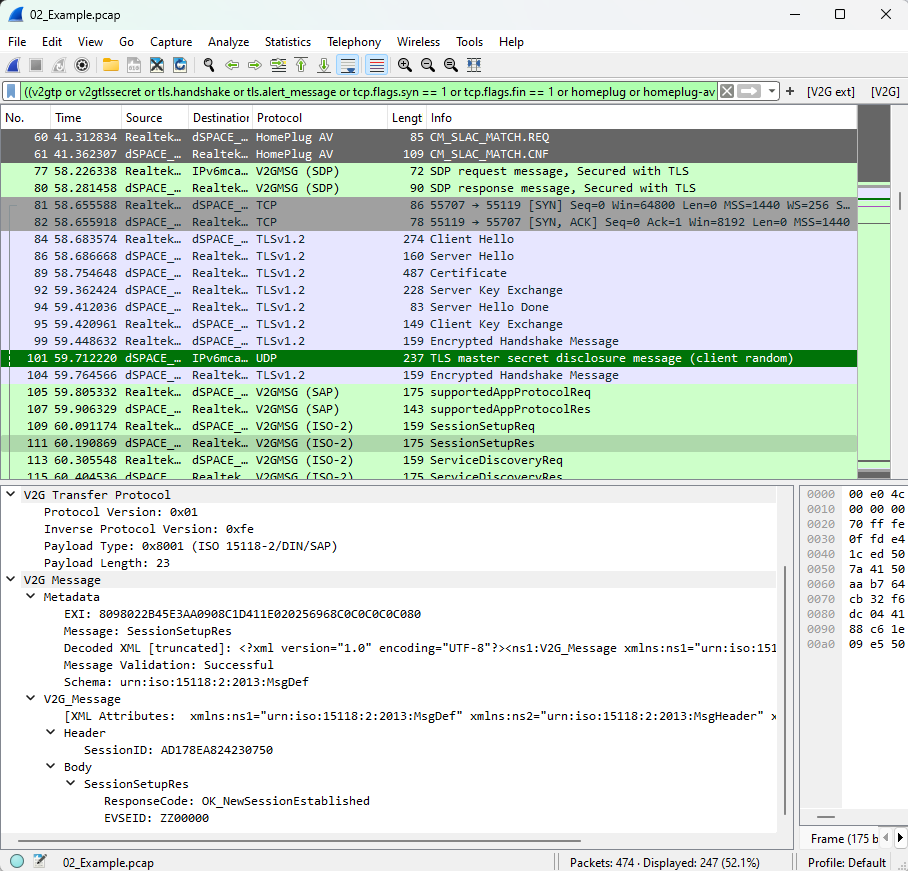
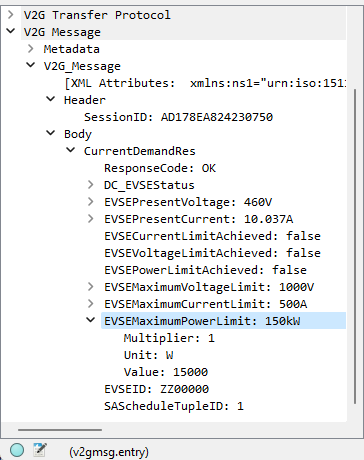
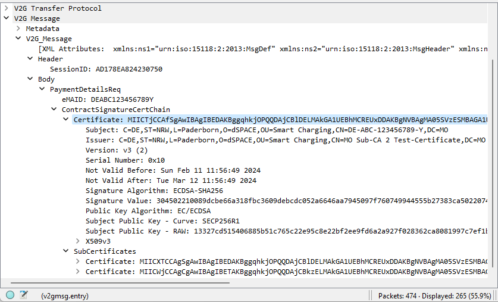
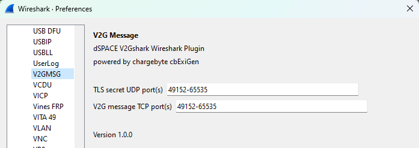

# dSPACE V2Gshark Wireshark Plugin

## Overview
This Wireshark plugin allows to analyze and decode packets between electric vehicles (EV) and charging stations (EVSE), also known as V2G messages.  

## Features
- Supports decoding of:
    - V2GTP layer (Vehicle to Grid Transport Protocol)
    - SAP messages (Supported App Protocol)
    - SDP messages (SECC Discovery Protocol)
    - DIN 70121  messages
    - ISO 15118-2 messages
    - ISO 15118-20 messages (preliminary support)
- Additional analysis features:
    - Validation of V2G messages according to XSD specification
    - Certificate information details for Plug & Charge (PnC)
    - Live TLS decryption (see below)
- Automatic schema detection
    - Detect schema automatically in case of missing SDP or SAP
- Color filter for V2G packets
- Filter buttons for V2G packets

## Requirements
- Wireshark (64 bit) 3.5.0 or higher
- Windows 7 or higher

## Installation notes
- The installer can be downloaded from [GitHub Releases](https://github.com/dspace-group/dsV2Gshark/releases/latest)
- When updating Wireshark, please reinstall the plugin to avoid any warnings
- Not compatible with other V2G dissector plugins. Please uninstall these plugins before installing dsV2Gshark.
- Not compatible with 32 bit versions of Wireshark.
- Updates of the plugin can be performed directly without deinstallation of the old version.
- Installation size is about 10 MB
- Supports normal and portable version of Wireshark

## Live TLS Decryption
The plugin processes a TLS master secret disclosure packet after handshake to decode the following V2G session.  
The disclosure message is a UDP packet within the source port range 49152-65535 (see Wireshark protocol settings) containing the ASCII string "CLIENT_RANDOM <32-byte client random> <48-byte master secret>" as payload data. This disclosure message has to be sent from one of the communication partners in a testing environment.

## Limitations
- ISO 15118-20 is not fully supported yet
- Live TLS decryption is only supported for TLS 1.2

## Support
- If you encounter any problems, feel free to open an issue or contact us at support@dSPACE.de
- We appreciate all contributions, from reporting bugs to implementing new features

## Further notes
- When sniffing V2G communication, lost packets may occur, which cause corrupted TCP/TLS sessions. In that case, it may help to activate the option to ignore Message Authentication Code (MAC) check failures in the Wireshark TLS protocol settings.  
    This option can be found under Wireshark Preferences - Protocols - TLS
- This plugin was built and tested with Wireshark 4.2.3
- The EXI decoding is based on [cbExiGen](https://github.com/EVerest/cbexigen)

## Screenshots
### Message Inspection

### Certificate Details

### Message Validation

### Live TLS Decryption

### Filter Buttons

### Plugin Preferences
